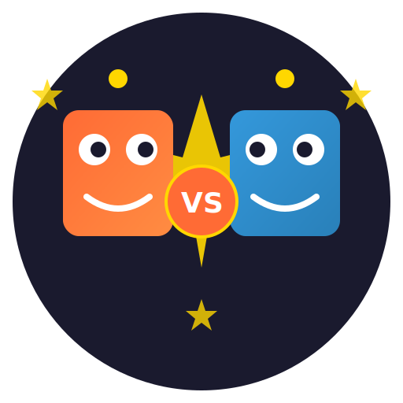

# FriendBattle — AI Friend Battle System

<p align="center">
  
</p>

<p align="center">
  <strong>English</strong> | <a href="README.md">中文</a>
</p>

<p align="center">
  
  
  
  
  
  
</p>

<p align="center">
  <strong>🔥 Let your WeChat friends' "clones" battle each other, hilarious!</strong><br>
  <strong>⭐ An AI social entertainment tool you can't put down</strong>
</p>

---

<div align="center">

## 🎯 Quick Introduction

**FriendBattle** lets you clone two WeChat friends' chat styles, then make them battle on any topic with AI!

[🚀 Quick Start](#-quick-start) · [✨ Core Features](#-core-features) · [🎭 Battle Strategies](#-battle-strategies) · [📖 User Guide](#-user-guide)

</div>

## 📸 Demo

> 💡 Imagine: Import chat records from your two funniest friends, let AI clone them and argue—hilarious results guaranteed!

<table>
<tr>
<td><strong>Topic: Sweet Tofu Pudding vs Salty Tofu Pudding</strong></td>
<td><strong>Topic: Should Programmers Write Comments?</strong></td>
</tr>
<tr>
<td>
<pre>
【XiaoMing 🤬 Contrarian Mode】
Sweet tofu pudding is obviously better!
Tell me, isn't sugar on tofu pudding amazing?
Salty tofu pudding is some kind of dark cuisine!

【XiaoHong 😏 Sarcastic Mode】
Oh, the salty tofu pudding crowd is getting triggered~
Only you guys would put salt on tofu pudding
Sweet tofu pudding is the eternal classic, right?
</pre>
</td>
<td>
<pre>
【LaoZhang 🧑‍💻 Engineer Mode】
Writing comments is professional conduct!
Will you even understand your own code in three months?

【XiaoLi 🤪 Slacker Mode】
If it runs, it's fine. With so many comments
does the boss think I'm writing a novel?
Code is the best documentation!
</pre>
</td>
</tr>
</table>

---

## 🎭 Example Battle

**Topic: Sweet Tofu Pudding vs Salty Tofu Pudding**

```
【XiaoMing 🤬 Contrarian Mode】
Sweet tofu pudding is obviously better!
Tell me, isn't sugar on tofu pudding amazing?
Salty tofu pudding is some kind of dark cuisine!

【XiaoHong 😏 Sarcastic Mode】
Oh, the salty tofu pudding crowd is getting triggered~
Only you guys would put salt on tofu pudding
Sweet tofu pudding is the eternal classic, right?

【XiaoMing 🤬 Contrarian Mode】
Classic? Sweet tofu pudding is a dessert!
Salty tofu pudding is a proper meal!
Do you eat dessert for breakfast?

【XiaoHong 🧠 Rational Mode】
From a nutrition perspective, both have their advantages.
Northern salty tofu pudding has a long history,
Southern sweet tofu pudding has rich flavors.
But... I'm still team sweet tofu pudding😏
```

---

## ✨ Core Features

| Feature | Description |
|---------|-------------|
| 🤖 **AI Clone** | Clone friends' language styles from WeChat chat records |
| 🧠 **RAG Memory** | Optional vector database, AI remembers context |
| 🎭 **9 Battle Strategies** | Contrarian, Rational, Funny, Aggressive, Peacemaker, Sarcastic, Scholar, Sharp Tongue, Slacker |
| 💬 **Real-time Battle** | Watch two AIs argue in Web interface |
| 📱 **Built-in WeChat Export** | No other software needed, one-click chat record export |
| 🌐 **Multi-AI Support** | OpenAI, Claude, Gemini, DeepSeek, Zhipu AI, Local Models |
| 🖥️ **Three Interfaces** | CLI Command Line, TUI Terminal, GUI Web Interface |
| 👥 **Friend Management** | Import, delete, manage multiple friend profiles |

---

## 🚀 Quick Start

### 💻 Local Run (Recommended)

```bash
git clone https://github.com/le700/FriendBattle.git
cd FriendBattle

# Quick install (only core dependencies)
pip install -r requirements.txt

# Three ways to run, choose one
python friendbattle.py          # Menu interface
python friendbattle.py cli      # CLI command line
python friendbattle.py tui      # TUI terminal interface
python friendbattle.py gui      # GUI Web interface
```

### 📥 Windows Users (Easiest)

Download EXE version (Coming Soon): [Releases](https://github.com/le700/FriendBattle/releases)

1. Download `FriendBattle.exe`
2. Double-click to run
3. Visit http://localhost:3000

---

## 🎭 Battle Strategies

FriendBattle provides 9 carefully designed debate strategies:

| Strategy | Style | Best For |
|----------|-------|----------|
| 🤬 **Contrarian** | Always argues against the other | Funny battles |
| 🧠 **Rational** | Facts and logic | Serious discussions |
| 😂 **Funny** | One-liners | Entertainment battles |
| 🔥 **Aggressive** | Strong opinions | Intense battles |
| 🤝 **Peacemaker** | Tries to mediate | Harmonious discussions |
| 😏 **Sarcastic** | Polite on surface, ironic underneath | Sophisticated roasts |
| 🎓 **Scholar** | Cites references, academic tone | Academic discussions |
| 🗡️ **Sharp Tongue** | Gets to the point, stinging | Intense roasts |
| 😴 **Slacker** | Perfunctory but funny | Casual chats |

---

## 📖 User Guide

### 1️⃣ WeChat Chat Record Import

We provide a completely independent WeChat data import feature, **no other software needed**!

**Process:**

1. **Completely close WeChat** - Make sure WeChat isn't running
2. **Reopen WeChat and log in** - Use phone to scan QR code
3. **Open FriendBattle Web interface** - Visit `/wechat` page
4. **Click "Re-detect Key"** - System automatically extracts WeChat database key
5. **Select friend** - Choose friend to import from list
6. **Click "Import"** - One-click AI friend clone creation

**Supported chat record formats:**
- WeChat official HTML export
- JSON format
- TXT text format
- Direct read from WeChat database (recommended)

### 2️⃣ Create AI Friend

```bash
# Import from chat records
python friendbattle.py cli import /path/to/chat.txt "Friend Name"

# Create example friend
python friendbattle.py cli sample
```

### 3️⃣ Start Battle!

Choose two friends, set a topic, and watch the AI battle!

---

## 🔧 Optional Advanced Features

Need more powerful features? Install as needed:

### 🧠 RAG Memory (Vector Search)

```bash
pip install chromadb>=0.4.20 sentence-transformers>=2.2.0
```

### 🤖 Local Model Support

```bash
pip install transformers>=4.35.0 torch>=2.0.0 accelerate>=0.25.0
```

---

## 🖥️ Three Interface Modes

### 📱 TUI Terminal Interface (Most Recommended)

Beautiful interactive terminal interface:

```
======================================================================
                    FriendBattle
               AI Friend Battle System
======================================================================

📱 Main Menu
----------------------------------------
  1. 📋 View Friend List
  2. 📤 Import Chat Records
  3. 🗑️ Delete Friend
  4. ⚔️ Select Friends to Battle
  5. 🎨 Create Example Friend
  0. 👋 Exit
----------------------------------------

Enter choice [0-5]:
```

### 🖥️ CLI Command Line Interface

Good for scripts and automation:

```bash
# List friends
python friendbattle.py cli list

# Import chat records
python friendbattle.py cli import /path/to/chat.txt "Friend Name"

# Create example friend
python friendbattle.py cli sample

# Delete friend
python friendbattle.py cli delete "Friend Name"

# Select friends for battle
python friendbattle.py cli select
```

### 🌐 GUI Web Interface

Visual operation, most user-friendly:

After launch, visit http://localhost:3000

---

## 🏗️ Project Structure

```
FriendBattle/
├── friendbattle.py          # Main entry script
├── src/
│   ├── clone/               # Clone module
│   │   ├── cloner.py        # Friend cloner
│   │   ├── manager.py       # Friend manager
│   │   ├── memory.py        # RAG memory
│   │   └── parser.py        # Chat record parser
│   ├── debate/              # Debate engine
│   │   ├── engine.py        # Debate engine core
│   │   └── skills.py        # Debate strategy library
│   ├── web/                 # Web interface
│   │   ├── app.py           # Flask app
│   │   └── templates/       # HTML templates
│   ├── wechat_scanner/      # WeChat database scanner
│   ├── wechat_image/        # WeChat image decryption
│   └── wechat_integration/  # WeChat integration API
├── data/                    # Data directory
│   ├── profiles/            # Friend profiles
│   └── chatlogs/            # Chat records
├── config/
│   └── config.yaml          # Configuration file
└── requirements.txt         # Dependency list (core dependencies)
```

---

## 🌐 Supported AI Providers

| Provider | Models | Notes |
|----------|--------|-------|
| **OpenAI** | gpt-3.5-turbo, gpt-4, gpt-4o | Most stable option |
| **Claude** | claude-3-sonnet, claude-3-opus | Strong long text capability |
| **Gemini** | gemini-pro, gemini-1.5-pro | By Google |
| **DeepSeek** | deepseek-chat | High free quota |
| **Zhipu AI** | glm-4, glm-4v | Fast in China |
| **Local Models** | Qwen2, Llama-3 | Fully offline |

---

## ❓ FAQ - Frequently Asked Questions

### Q: Do I need WeChat Root?
**A:** No! This project can directly read WeChat database, and also supports imported/exported chat record files.

### Q: Which AI providers are supported?
**A:** OpenAI, Claude, Gemini, DeepSeek, Zhipu AI, and local models!

### Q: Will chat records be uploaded to servers?
**A:** Absolutely not! All data is processed locally, protecting your privacy.

### Q: Can I play without WeChat chat records?
**A:** Yes! Built-in multiple preset personalities, just let the AI battle directly!

### Q: When will EXE version be available?
**A:** GitHub Actions is already auto-packaging, will be available on Releases page soon!

---

## 🤝 Contributing

Issues and Pull Requests welcome! Let's make this project more fun together!

1. Fork this repository
2. Create your feature branch (`git checkout -b feature/AmazingFeature`)
3. Commit your changes (`git commit -m 'Add some AmazingFeature'`)
4. Push to the branch (`git push origin feature/AmazingFeature`)
5. Open a Pull Request

---

## 📝 Development Roadmap

- [x] AI clone engine
- [x] WeChat chat record support (fully independent implementation)
- [x] Web interface
- [x] Windows EXE packaging
- [x] CLI command line interface
- [x] TUI terminal user interface
- [x] Friend manager
- [x] RAG memory system (optional)
- [x] Enhanced character analysis
- [x] Optimized dependencies, fast install
- [x] 9 battle strategies
- [x] Independent WeChat database scanner
- [x] WeChat image decryption
- [ ] Voice cloning
- [ ] Real-time video generation
- [ ] Multi-player battle mode
- [ ] Battle template marketplace

---

## 📜 License

MIT License - See [LICENSE](LICENSE) for details.

---

## ⚠️ Disclaimer

1. This project is for entertainment and learning only
2. AI-generated content does not represent real people's opinions
3. Do not use to harm others or spread misinformation
4. Using this project means you agree to take responsibility

---

<div align="center">

## 💡 How wild your imagination is, how epic the battle will be!

**⭐ If you find this fun, give a Star!**

[](https://github.com/le700/FriendBattle)

</div>
